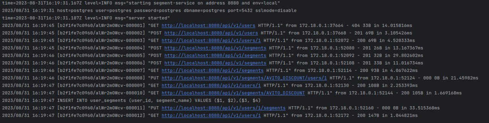

# [Тестовое задание](https://github.com/avito-tech/backend-trainee-assignment-2023) для стажёра Backend

## Запуск

```bash
docker-compose up -d
```

## Использование
Swagger doc: http://localhost:8080/swagger/index.html


В файле http_requests.http представлен минимальный набор тестов


Используя UI Goland можно запустить их все, ожидаемый результат


Ожидаемые логи:


Размышления по доп.заданиям:

1) Для хранения истории попадания\выбывания пользователя из сегмента можно добавить таблицу History с 
необходимыми полями для отчета, производить вставку в эту таблицу в рамках транзакции в методах, добавляющих\удаляющих 
пользователя в\из сегментов. Также заведем дополнительное поле - created_at, default: now(), чтобы знать время попадания.
Теперь мы можем делать запросы к таблице с условием по дате и возвращать результат. Генерить csv можно без доп тулзов,
используя встроенные средства PostgreSQL. Как возвращать ссылку, не пользуясь возможностью залить по апи на сторонний 
ресурс + сделать просто - нужно подумать)
2) TTL на стороне бд - создадим доп поле expiration_date и на запросы на чтение будем добавлять условие с проверкой 
текущего времени. Тогда в результат запроса не попадут те юзеры, для которых TTL вышло.
3) Пойдем в бд и узнаем число юзеров (count), знаем сколько нужно добавить, можно ограничить LIMIT добавление, если 
нужен шаффл - на стороне приложения можно взять в память, зашафлить, взять K. Звучит не очень эффективно, можно 
посмотреть варианты рандомной выборки на стороне бд. Нужно будет подумать что делать в случае "дайте 10% юзеров" когда у
нас он 0/1 итд

Комментарий к решению:
В таблицу segment в качестве первичного ключа выбран name, имеющий тип varchar
Это решение было принято по следующей причине: если использовать bigserial и Unique ограничение
на name, то при запросах вставки юзера в сегмент нужно делать доп. запрос с джойном, а моделируя 
таким образом - можно делать вставку user_id, name прям из request с клиента одним запросом
Возможно, это все же suboptimal, ведь при вставке из двух списков доп запроса избежать не удалось

Кажется, текущее решение далеко от идеала, но путь выбран верный :)